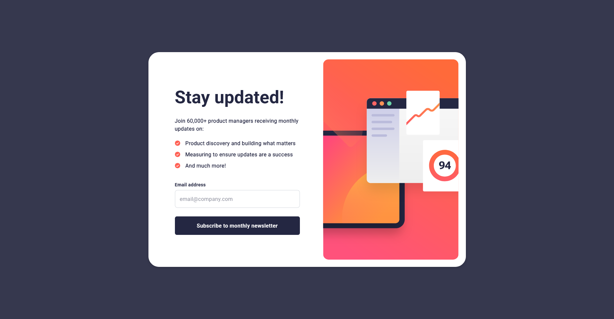
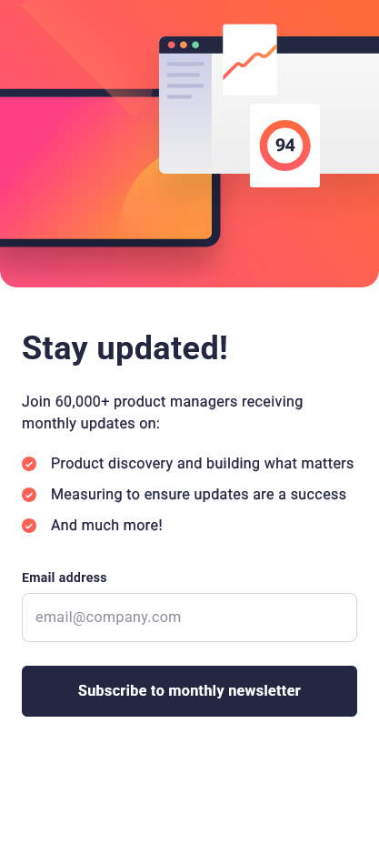

# Frontend Mentor - Newsletter sign-up form with success message solution

This is a solution to the [Newsletter sign-up form with success message challenge on Frontend Mentor](https://www.frontendmentor.io/challenges/newsletter-signup-form-with-success-message-3FC1AZbNrv). Frontend Mentor challenges help you improve your coding skills by building realistic projects. 

## Table of contents

- [Overview](#overview)
  - [The challenge](#the-challenge)
  - [Screenshot](#screenshot)
  - [Links](#links)
- [My process](#my-process)
  - [Built with](#built-with)
  - [What I learned](#what-i-learned)
- [Author](#author)

## Overview

### The challenge

Users should be able to:

- Add their email and submit the form
- See a success message with their email after successfully submitting the form
- See form validation messages if:
- The field is left empty
- The email address is not formatted correctly
- View the optimal layout for the interface depending on their device's screen size
- See hover and focus states for all interactive elements on the page

### Screenshot

#### Desktop Design

#### Mobile Design

### Links

- Solution URL: [https://github.com/Akiz-Ivanov/newsletter-sign-up](https://github.com/Akiz-Ivanov/newsletter-sign-up)
- Live Site URL: [https://akiz-ivanov.github.io/newsletter-sign-up/](https://akiz-ivanov.github.io/newsletter-sign-up/)

## My process

### Built with

- **Vanilla JavaScript** – for form validation and dynamic UI
- **Tailwind CSS** – for styling and responsive design
- **Flexbox** – for layout
- **Mobile-first workflow**

### What I learned

I chose to build this with plain JavaScript instead of React as a refresher and to challenge myself with manual DOM manipulation and validation logic. Even if React might've made the state transitions slightly easier.

Additionally, I practiced adapting SVG illustrations across breakpoints, balancing visuals between tablet and mobile layouts.

## Author

- Frontend Mentor - [@Akiz97](https://www.frontendmentor.io/profile/Akiz97)